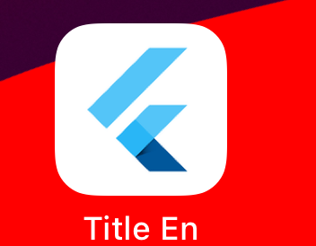
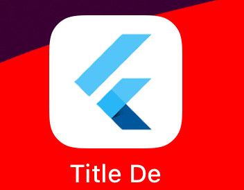

# Localizing App Title for Android and iOS

This project serves as an example of how to localize the app title for both Android and iOS, as explained in a related article on Medium. It provides a practical guide to help you implement app title localization in your Flutter application, ensuring that your app’s title adapts to the language and regional settings of the user's device.

## Final Output

Once you have completed the localization setup, here’s a preview of the final output on both Android and iOS:

### Android Output

Below are the screenshots showing the localized app title on Android for different languages:

1. **English**  
   

2. **Italian**  
   

3. **German**  
   

### iOS Output

Here are the screenshots showing the localized app title on iOS for different languages:

1. **English**  
   

2. **Italian**  
   

3. **German**  
   

## Related Article

For a detailed explanation and step-by-step guide on how to localize the app title for both platforms, refer to the [Medium article](https://medium.com/@geraldnuraj/how-to-localize-the-app-name-in-flutter-b3cec4b77e3d). This article includes all the background information, setup instructions, and troubleshooting tips for implementing localization in your app.

